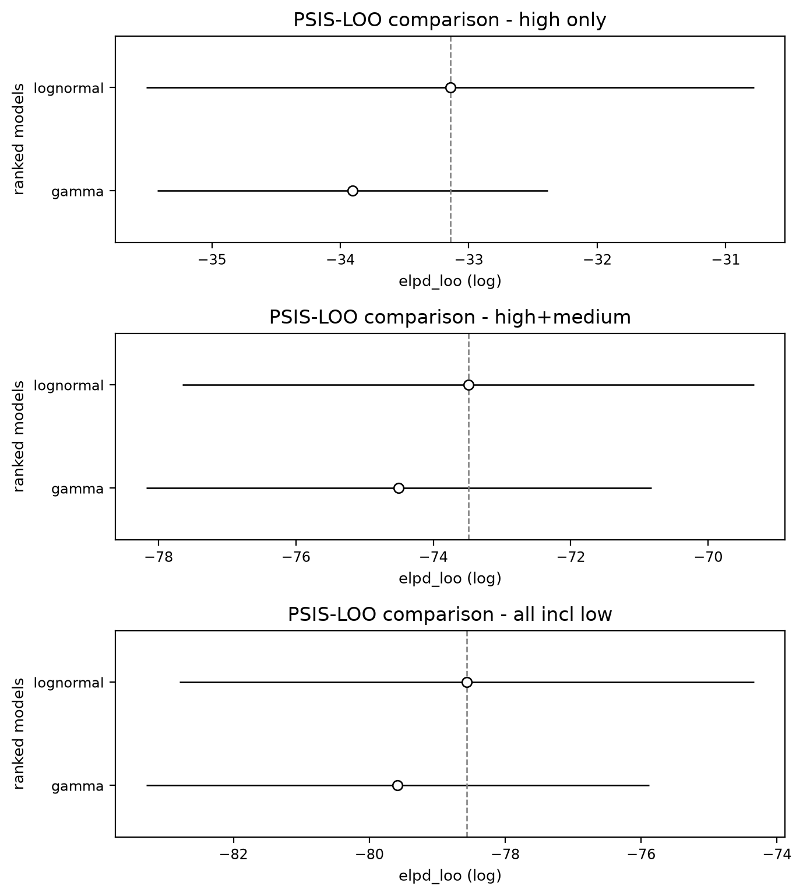
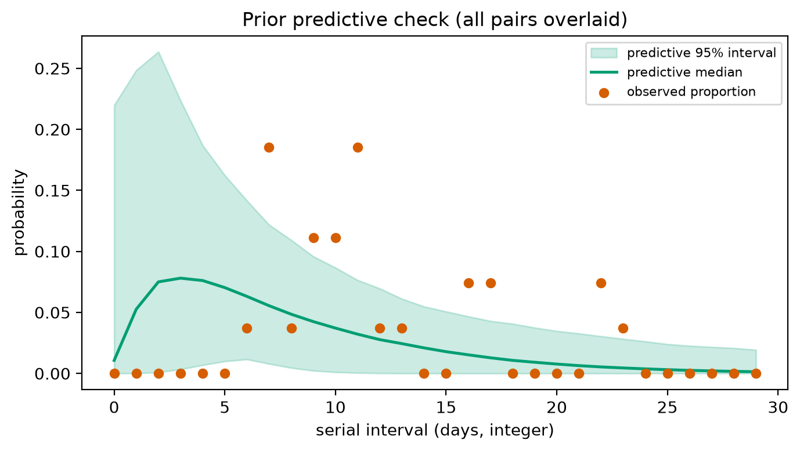
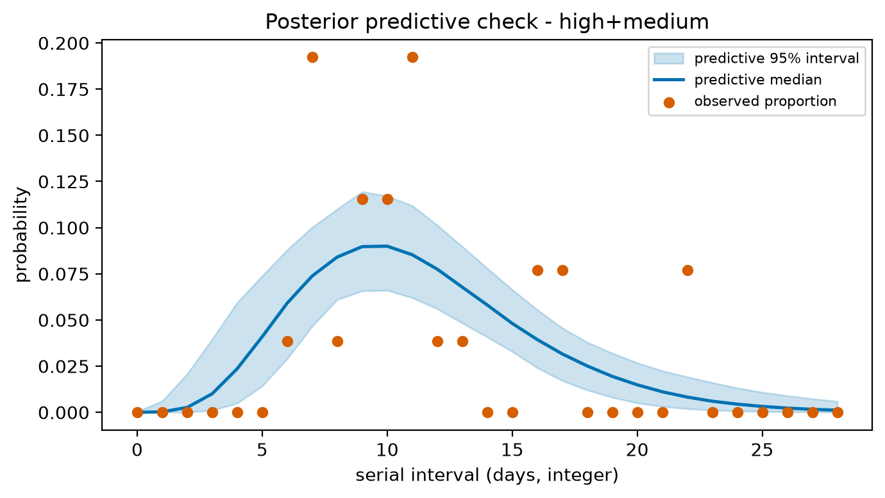
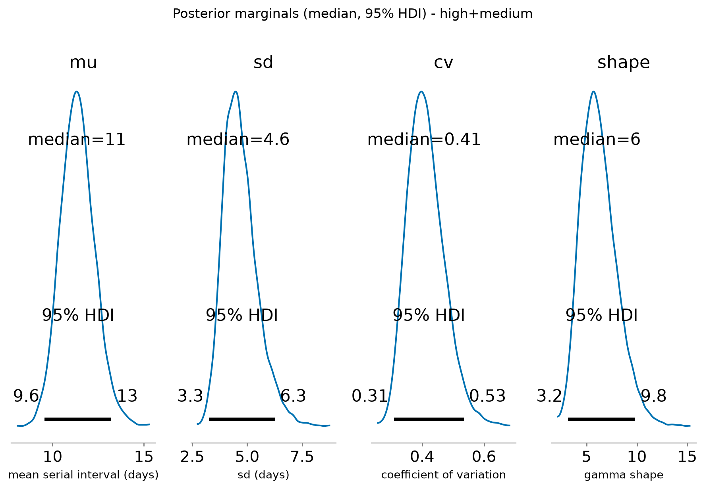
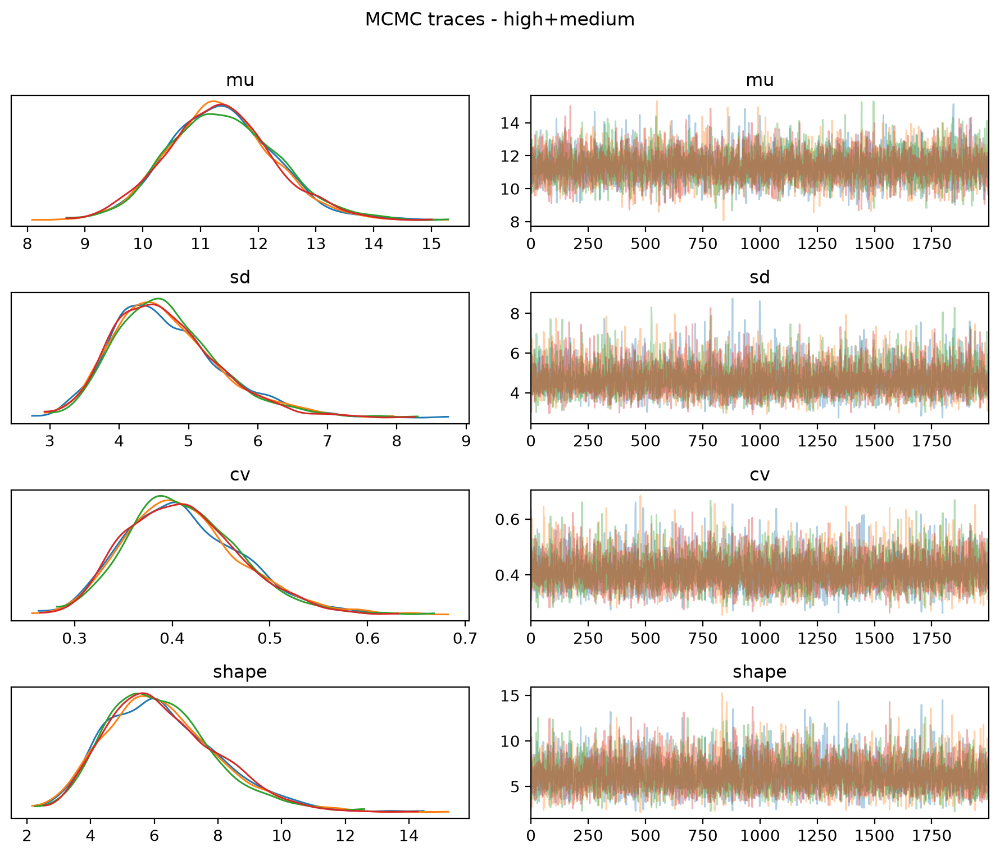
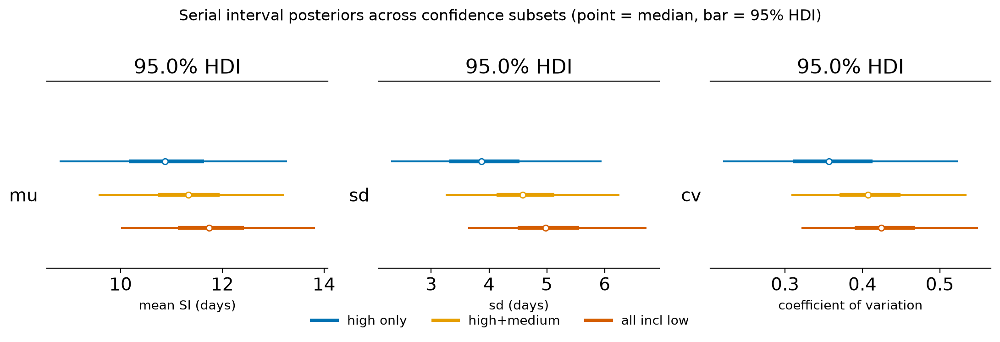
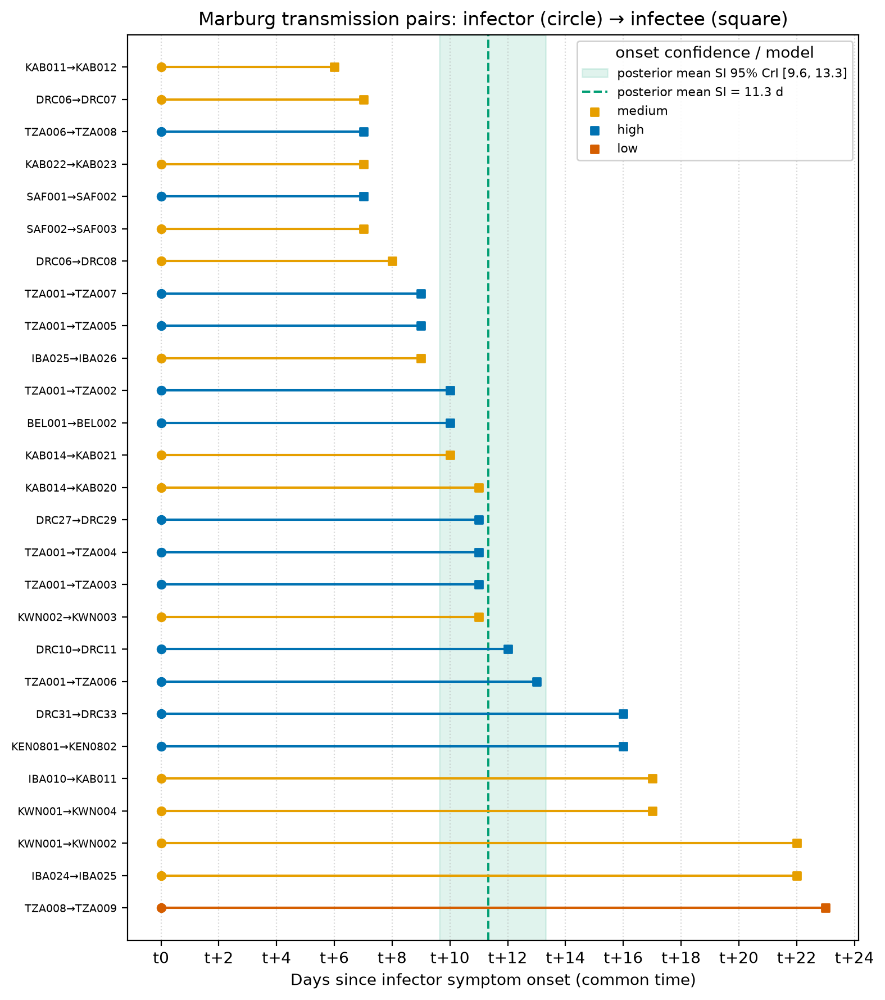
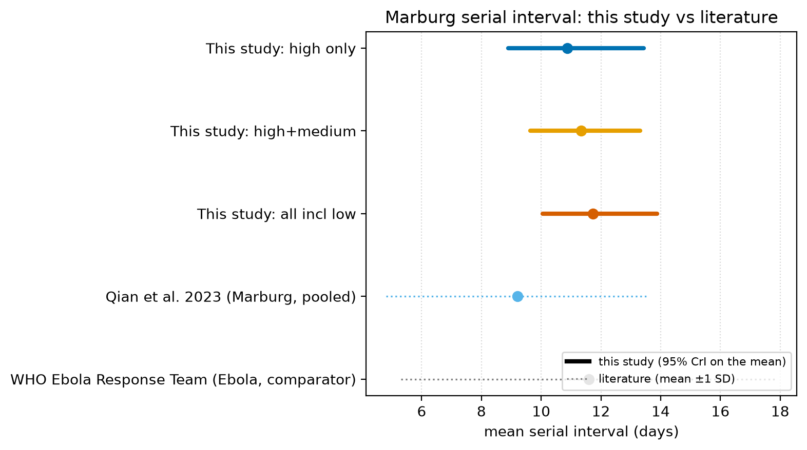
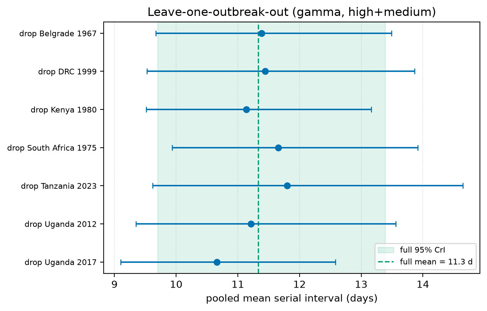

# Overview

This appendix documents the Bayesian serial-interval analysis: the
double-interval-censored likelihood, the gamma and lognormal delay families and
their priors, MCMC settings, convergence diagnostics, model comparison by
leave-one-out cross-validation, prior and posterior predictive checks, and a
comparison with the published literature. Maximum-likelihood equivalents are in
the R reference implementation (`R/estimate_serial_interval.R`,
`primarycensored`).

# Data and transmission pairs

Infector–infectee pairs were reconstructed from two-case chains, published
case narratives, and digitized transmission-tree figures, each tagged with a
confidence tier (high, medium, low) and its basis
(`data/marburg_transmission_pairs.csv`). The serial interval of a pair is
onset(infectee) – onset(infector) in days. Because both onsets are recorded
to the day, the observed integer delay is doubly interval-censored.

# Model

For a pair with observed integer delay *n*, fix the infector onset day at 0 with
a within-day offset *a* ~ Uniform(0, 1) (the primary event). The infectee true
onset falls in day *n*, i.e. in [*n*, *n*+1). For a delay density *f* with CDF
*F*, the pair likelihood is

$$\Pr(N = n) = \int_0^1 \big[ F(n + 1 - a) - F(n - a) \big]\, da,$$

with *F*(*t*) = 0 for *t* –< 0. The primary offset is marginalized by 64-node
midpoint quadrature. Two delay families are fit, both parameterized by the mean
– mu (days) so estimates are directly comparable: a gamma (shape *k*, so
SD = mu/sqrt(*k*), CV = 1/sqrt(*k*)) and a lognormal (sdlog – sigma, meanlog
set so E[*T*] = mu, CV = sqrt(exp(sigma^2) – 1)).

Priors (weakly informative, centered on an ~8-day Marburg serial interval):
mu ~ LogNormal(log 8, 0.6); gamma *k* ~ LogNormal(log 2, 0.7); lognormal
sigma ~ HalfNormal(0.5). Inference used the NUTS sampler (NumPyro): 4 chains,
1000 warmup and 2000 sampling iterations each (8000 posterior draws), seed 1834.

# Posterior estimates

: Appendix Table 1. Gamma posterior serial-interval estimates (median, 95% credible interval).

| Subset       |   Pairs | Mean SI, d (95% CrI)   | SD, d (95% CrI)   | CV (95% CrI)     |
|:-------------|--------:|:-----------------------|:------------------|:-----------------|
| high only    |      13 | 10.9 (8.9–13.4)        | 3.9 (2.6–6.4)     | 0.36 (0.24–0.56) |
| high+medium  |      26 | 11.3 (9.6–13.3)        | 4.6 (3.4–6.5)     | 0.41 (0.31–0.55) |
| all incl low |      27 | 11.7 (10.1–13.9)       | 5.0 (3.8–7.0)     | 0.42 (0.33–0.57) |

: Appendix Table 2. Lognormal posterior serial-interval estimates (median, 95% credible interval).

| Subset       |   Pairs | Mean SI, d (95% CrI)   | SD, d (95% CrI)   | CV (95% CrI)     |
|:-------------|--------:|:-----------------------|:------------------|:-----------------|
| high only    |      13 | 10.9 (9.4–12.9)        | 3.0 (2.0–5.4)     | 0.28 (0.18–0.46) |
| high+medium  |      26 | 11.4 (9.9–13.4)        | 4.3 (3.1–6.7)     | 0.38 (0.29–0.54) |
| all incl low |      27 | 11.8 (10.2–13.9)       | 4.7 (3.5–7.3)     | 0.40 (0.31–0.56) |

# Convergence diagnostics

All parameters converged (R-hat = 1.00; bulk and tail effective sample sizes in
the thousands from 8000 draws). Diagnostics are shown for the gamma model; the
lognormal fits converged equally well.

: Appendix Table 3. MCMC convergence diagnostics (gamma model).

| Subset       | Parameter   |   Mean |    SD |   ESS (bulk) |   ESS (tail) |   R-hat |
|:-------------|:------------|-------:|------:|-------------:|-------------:|--------:|
| high only    | mu          | 10.945 | 1.136 |         4253 |         4159 |       1 |
| high only    | sd          |  4.02  | 1.007 |         4412 |         4338 |       1 |
| high only    | cv          |  0.367 | 0.081 |         4261 |         4622 |       1 |
| high only    | shape       |  8.481 | 3.606 |         4261 |         4622 |       1 |
| high+medium  | mu          | 11.366 | 0.93  |         5216 |         4697 |       1 |
| high+medium  | sd          |  4.688 | 0.781 |         5462 |         4767 |       1 |
| high+medium  | cv          |  0.413 | 0.06  |         5294 |         5215 |       1 |
| high+medium  | shape       |  6.242 | 1.771 |         5294 |         5215 |       1 |
| all incl low | mu          | 11.807 | 0.986 |         5473 |         4511 |       1 |
| all incl low | sd          |  5.091 | 0.833 |         6342 |         4942 |       1 |
| all incl low | cv          |  0.431 | 0.06  |         6599 |         4962 |       1 |
| all incl low | shape       |  5.68  | 1.52  |         6599 |         4962 |       1 |

# Model comparison: gamma vs lognormal

The two families were compared by Pareto-smoothed importance-sampling
leave-one-out cross-validation (PSIS-LOO). The lognormal has the higher expected
log predictive density in every subset, but the difference is small relative to
its standard error (dELPD < 1 with SE(d) of comparable size, Appendix
Table 4, Appendix Figure 1), so the two families are not
distinguishable on these data. This agrees with the maximum-likelihood AIC
comparison (Appendix Table 5), which also favors the lognormal marginally.
Gamma is retained as the primary model for consistency with the
generation-interval convention used in the reproduction-number calculation.

: Appendix Table 4. PSIS-LOO comparison of gamma and lognormal. dELPD is the difference from the best model; SE(d) its standard error.

| Subset       | Family    |   Rank |   ELPD (LOO) |   p_LOO |   dELPD |   SE(d) |   Weight |
|:-------------|:----------|-------:|-------------:|--------:|--------:|--------:|---------:|
| high only    | lognormal |      0 |       -33.14 |    1.67 |    0    |    0    |        1 |
| high only    | gamma     |      1 |       -33.91 |    0.96 |    0.76 |    0.97 |        0 |
| high+medium  | lognormal |      0 |       -73.49 |    1.66 |    0    |    0    |        1 |
| high+medium  | gamma     |      1 |       -74.5  |    1.45 |    1.02 |    0.56 |        0 |
| all incl low | lognormal |      0 |       -78.56 |    1.56 |    0    |    0    |        1 |
| all incl low | gamma     |      1 |       -79.58 |    1.36 |    1.02 |    0.6  |        0 |

{width=90%}

: Appendix Table 5. Maximum-likelihood family comparison (R, `primarycensored`; double interval-censored).

| Subset       |   Mean SI, d |    CV | Best (AIC)   |   AIC gamma |   AIC lognormal |   AIC Weibull |
|:-------------|-------------:|------:|:-------------|------------:|----------------:|--------------:|
| high only    |        11.25 | 0.224 | lognormal    |       60.11 |           59.97 |         61.55 |
| high+medium  |        11.81 | 0.344 | lognormal    |      148.76 |          147.52 |        152.52 |
| all incl low |        12.22 | 0.365 | lognormal    |      159.02 |          157.63 |        162.68 |

## Effect on the reproduction number

The Monte Carlo R0 uses the Wallinga–Lipsitch relation R0 = 1 / *M*(–*r*),
where *M* is the moment-generating function (Laplace transform) of the
generation interval and *r* the growth rate. For a gamma generation interval
this has the closed form R0 = (1 + *r* Tg / kappa)^kappa with kappa = 1/CV^2,
which is what the current pipeline uses (`R/estimate_R0_montecarlo.R`). A
lognormal generation interval has no closed-form MGF, so adopting it would
require evaluating *M*(–*r*) = E[exp(–*r T*)] numerically (for example by
quadrature over the lognormal density) at each Monte Carlo draw. Because the two
families are indistinguishable by LOO and give near-identical means and CVs, the
gamma closed form is retained; the numerical-Laplace-transform route is the
correct extension if a lognormal generation interval is preferred.

# Predictive checks

The prior predictive distribution covers the observed serial-interval range
before fitting (Appendix Figure 2). The posterior predictive
distribution reproduces the central mass of the observed delays; residual spread
in the tails is consistent with the small sample and the star-shaped dependence
among pairs that share the Tanzania index (Appendix Figure 3).

{width=90%}

{width=90%}

# Posterior and sampling diagnostics (gamma, high+medium subset)

{width=90%}

{width=90%}

{width=90%}

Rank plots and per-subset trace, posterior, and predictive figures for the
high-only and all-pairs subsets are in `outputs/figures/`.

# Transmission-pair timelines

{width=90%}

# Comparison with the literature

Estimates from the reconstructed pairs run longer than the pooled published mean
(Qian et al. 2023, 9.2 d); the Ebola Zaire value is a comparator, not Marburg
(Appendix Figure 8, Appendix Table 6).

{width=90%}

: Appendix Table 6. Serial interval, this study versus published estimates.

| Source                                                     | Population                                    | Family   |   Mean, d |   95% lo |   95% hi |   SD, d |    CV | DOI                         |
|:-----------------------------------------------------------|:----------------------------------------------|:---------|----------:|---------:|---------:|--------:|------:|:----------------------------|
| This study (NumPyro, double-censored)                      | Marburg, high only                            | gamma    |     10.87 |     8.9  |    13.44 |         |       |                             |
| This study (NumPyro, double-censored)                      | Marburg, high+medium                          | gamma    |     11.33 |     9.64 |    13.31 |         |       |                             |
| This study (NumPyro, double-censored)                      | Marburg, all incl low                         | gamma    |     11.74 |    10.06 |    13.89 |         |       |                             |
| Qian et al. 2023, medRxiv preprint                         | Marburg (all 15 outbreaks, pooled line lists) | gamma    |      9.2  |          |          |     4.4 | 0.478 | 10.1101/2022.06.17.22276538 |
| WHO Ebola Response Team, NEJM 2014 (cited in Qian Table 1) | Ebola Zaire (comparator, NOT Marburg)         | gamma    |     11.6  |          |          |     6.3 | 0.543 | 10.1056/NEJMoa1411100       |

## Source of the difference from Qian et al. 2023

Qian et al. estimated their serial interval from 26 infector–infectee pairs
identified in five outbreaks (DRC, Kenya, South Africa, Belgrade, Uganda 2012)
by fitting a gamma to the raw onset-to-onset differences, without interval
censoring, using whole-outbreak linelists. Two points follow. First, the
difference is not the censoring method: restricting our pairs to those same five
outbreaks gives 16 pairs with a naive mean of 11.0 d
(SD 4.6), still well above 9.2 d, and our SD there matches theirs. Second,
it is not outbreak coverage: our newer outbreaks (Tanzania 2023, Uganda 2017)
move the pooled estimate only slightly. The gap is pair ascertainment: Qian
identified 26 pairs in those five outbreaks where we identified 16, and their
more inclusive linelist pairing (largest in the ~150-case DRC 1999-2000 linelist)
yields shorter intervals, whereas we used explicit, sequence- or figure-confirmed
transmission-tree links. A direct pair-by-pair comparison was not possible: the
data repository cited in Qian et al. (github.com/GeorgeYQian/MVD-Branching-
Process-Model-Repository) returns HTTP 404 and is no longer available.

# Leave-one-outbreak-out sensitivity

Refitting the gamma mean with each outbreak dropped in turn (high+medium set)
leaves the pooled mean between 11.1 and 12.4 d, all credible intervals
overlapping the full estimate (Appendix Figure 9, Appendix Table
7). No single outbreak drives the result; dropping Uganda 2017 (the
longest-SI outbreak) still leaves the mean near 11.1 d, above the Qian value.

{width=90%}

: Appendix Table 7. Leave-one-outbreak-out pooled mean serial interval.

| Dropped outbreak   |   Pairs | Mean SI, d (95% CrI)   |
|:-------------------|--------:|:-----------------------|
| none (full)        |      26 | 11.3 (9.7–13.4)        |
| Belgrade 1967      |      25 | 11.4 (9.7–13.5)        |
| DRC 1999           |      21 | 11.4 (9.5–13.9)        |
| Kenya 1980         |      25 | 11.1 (9.5–13.2)        |
| South Africa 1975  |      24 | 11.7 (9.9–13.9)        |
| Tanzania 2023      |      19 | 11.8 (9.6–14.7)        |
| Uganda 2012        |      19 | 11.2 (9.3–13.6)        |
| Uganda 2017        |      23 | 10.7 (9.1–12.6)        |

# Reproducibility and data availability

All stochastic code is seeded with 1834. Bayesian estimation used Python 3.13.5
(numpyro 0.21.0, jax 0.11.1, arviz 0.23.4, numpy 2.5.3, pandas 3.0.5); the maximum-likelihood reference used R with the `primarycensored`
package. Python dependencies are pinned in `uv.lock`. Source data
(`data/marburg_transmission_pairs.csv`, per-outbreak line lists) and all code
(`python/`, `R/`, `julia/`) are in the project repository; tables and figures in
this appendix are regenerated from them by `task py:appendix`.
